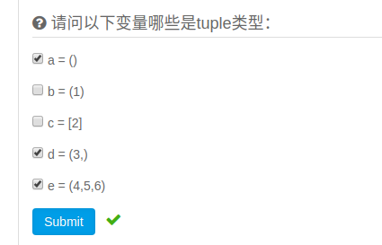

<h3>list</h3>

Python内置的一种数据类型是列表：list。list是一种有序的集合，可以随时添加和删除其中的元素。

比如，列出班里所有同学的名字，就可以用一个list表示：

<pre><code class="python">&gt;&gt;&gt; classmates = ['Michael', 'Bob', 'Tracy']
&gt;&gt;&gt; classmates
['Michael', 'Bob', 'Tracy']
</code></pre>

变量<code>classmates</code>就是一个list。用<code>len()</code>函数可以获得list元素的个数：

<pre><code class="python">&gt;&gt;&gt; len(classmates)
3
</code></pre>

用索引来访问list中每一个位置的元素，记得索引是从<code>0</code>开始的：

<pre><code class="xml">&gt;&gt;&gt; classmates[0]
'Michael'
&gt;&gt;&gt; classmates[1]
'Bob'
&gt;&gt;&gt; classmates[2]
'Tracy'
&gt;&gt;&gt; classmates[3]
Traceback (most recent call last):
  File "&lt;stdin&gt;", line 1, in &lt;module&gt;
IndexError: list index out of range
</code></pre>

当索引超出了范围时，Python会报一个<code>IndexError</code>错误，所以，要确保索引不要越界，记得最后一个元素的索引是<code>len(classmates) - 1</code>。

如果要取最后一个元素，除了计算索引位置外，还可以用<code>-1</code>做索引，直接获取最后一个元素：

<pre><code class="python">&gt;&gt;&gt; classmates[-1]
'Tracy'
</code></pre>

以此类推，可以获取倒数第2个、倒数第3个：

<pre><code class="xml">&gt;&gt;&gt; classmates[-2]
'Bob'
&gt;&gt;&gt; classmates[-3]
'Michael'
&gt;&gt;&gt; classmates[-4]
Traceback (most recent call last):
  File "&lt;stdin&gt;", line 1, in &lt;module&gt;
IndexError: list index out of range
</code></pre>

当然，倒数第4个就越界了。

list是一个可变的有序表，所以，可以往list中追加元素到末尾：

<pre><code class="python">&gt;&gt;&gt; classmates.append('Adam')
&gt;&gt;&gt; classmates
['Michael', 'Bob', 'Tracy', 'Adam']
</code></pre>

也可以把元素插入到指定的位置，比如索引号为<code>1</code>的位置：

<pre><code class="python">&gt;&gt;&gt; classmates.insert(1, 'Jack')
&gt;&gt;&gt; classmates
['Michael', 'Jack', 'Bob', 'Tracy', 'Adam']
</code></pre>

要删除list末尾的元素，用<code>pop()</code>方法：

<pre><code class="python">&gt;&gt;&gt; classmates.pop()
'Adam'
&gt;&gt;&gt; classmates
['Michael', 'Jack', 'Bob', 'Tracy']
</code></pre>

要删除指定位置的元素，用<code>pop(i)</code>方法，其中<code>i</code>是索引位置：

<pre><code class="python">&gt;&gt;&gt; classmates.pop(1)
'Jack'
&gt;&gt;&gt; classmates
['Michael', 'Bob', 'Tracy']
</code></pre>

要把某个元素替换成别的元素，可以直接赋值给对应的索引位置：

<pre><code class="python">&gt;&gt;&gt; classmates[1] = 'Sarah'
&gt;&gt;&gt; classmates
['Michael', 'Sarah', 'Tracy']
</code></pre>

list里面的元素的数据类型也可以不同，比如：

<pre><code class="python">&gt;&gt;&gt; L = ['Apple', 123, True]
</code></pre>

list元素也可以是另一个list，比如：

<pre><code class="python">&gt;&gt;&gt; s = ['python', 'java', ['asp', 'php'], 'scheme']
&gt;&gt;&gt; len(s)
4
</code></pre>

要注意<code>s</code>只有4个元素，其中<code>s[2]</code>又是一个list，如果拆开写就更容易理解了：

<pre><code class="python">&gt;&gt;&gt; p = ['asp', 'php']
&gt;&gt;&gt; s = ['python', 'java', p, 'scheme']
</code></pre>

要拿到<code>'php'</code>可以写<code>p[1]</code>或者<code>s[2][1]</code>，因此<code>s</code>可以看成是一个二维数组，类似的还有三维、四维……数组，不过很少用到。

如果一个list中一个元素也没有，就是一个空的list，它的长度为0：

<pre><code class="python">&gt;&gt;&gt; L = []
&gt;&gt;&gt; len(L)
0
</code></pre>
<h3>tuple</h3>

另一种有序列表叫元组：tuple。tuple和list非常类似，但是tuple一旦初始化就不能修改，比如同样是列出同学的名字：

<pre><code class="python">&gt;&gt;&gt; classmates = ('Michael', 'Bob', 'Tracy')
</code></pre>

现在，classmates这个tuple不能变了，它也没有append()，insert()这样的方法。其他获取元素的方法和list是一样的，你可以正常地使用<code>classmates[0]</code>，<code>classmates[-1]</code>，但不能赋值成另外的元素。

不可变的tuple有什么意义？因为tuple不可变，所以代码更安全。如果可能，能用tuple代替list就尽量用tuple。

tuple的陷阱：当你定义一个tuple时，在定义的时候，tuple的元素就必须被确定下来，比如：

<pre><code class="python">&gt;&gt;&gt; t = (1, 2)
&gt;&gt;&gt; t
(1, 2)
</code></pre>

如果要定义一个空的tuple，可以写成<code>()</code>：

<pre><code class="python">&gt;&gt;&gt; t = ()
&gt;&gt;&gt; t
()
</code></pre>

但是，要定义一个只有1个元素的tuple，如果你这么定义：

<pre><code class="python">&gt;&gt;&gt; t = (1)
&gt;&gt;&gt; t
1
</code></pre>

定义的不是tuple，是<code>1</code>这个数！这是因为括号<code>()</code>既可以表示tuple，又可以表示数学公式中的小括号，这就产生了歧义，因此，Python规定，这种情况下，按小括号进行计算，计算结果自然是<code>1</code>。

所以，只有1个元素的tuple定义时必须加一个逗号<code>,</code>，来消除歧义：

<pre><code class="python">&gt;&gt;&gt; t = (1,)
&gt;&gt;&gt; t
(1,)
</code></pre>

Python在显示只有1个元素的tuple时，也会加一个逗号<code>,</code>，以免你误解成数学计算意义上的括号。

最后来看一个“可变的”tuple：

<pre><code class="python">&gt;&gt;&gt; t = ('a', 'b', ['A', 'B'])
&gt;&gt;&gt; t[2][0] = 'X'
&gt;&gt;&gt; t[2][1] = 'Y'
&gt;&gt;&gt; t
('a', 'b', ['X', 'Y'])
</code></pre>

这个tuple定义的时候有3个元素，分别是<code>'a'</code>，<code>'b'</code>和一个list。不是说tuple一旦定义后就不可变了吗？怎么后来又变了？

别急，我们先看看定义的时候tuple包含的3个元素：

当我们把list的元素<code>'A'</code>和<code>'B'</code>修改为<code>'X'</code>和<code>'Y'</code>后，tuple变为：

表面上看，tuple的元素确实变了，但其实变的不是tuple的元素，而是list的元素。tuple一开始指向的list并没有改成别的list，所以，tuple所谓的“不变”是说，tuple的每个元素，指向永远不变。即指向<code>'a'</code>，就不能改成指向<code>'b'</code>，指向一个list，就不能改成指向其他对象，但指向的这个list本身是可变的！

理解了“指向不变”后，要创建一个内容也不变的tuple怎么做？那就必须保证tuple的每一个元素本身也不能变。

<h3>练习</h3>

请用索引取出下面list的指定元素：

<form class="uk-form uk-form-stack uk-margin-top uk-margin-bottom" action="#0"><pre id="pre-online-run-code-1" style="font-size: 14px; margin-bottom: 0px; border-bottom: none; padding: 6px; border-bottom-left-radius: 0px; border-bottom-right-radius: 0px; white-space: pre-wrap; overflow-wrap: break-word; word-break: break-all;"># -*- coding: utf-8 -*-

L = [
    ['Apple', 'Google', 'Microsoft'],
    ['Java', 'Python', 'Ruby', 'PHP'],
    ['Adam', 'Bart', 'Lisa']
]
</pre><textarea id="textarea-online-run-code-1" onkeyup="_mdAdjustTextareaHeight(this)" class="uk-width-1-1 x-codearea" rows="10" style="overflow: scroll; border-top-left-radius: 0; border-top-right-radius: 0;"></textarea><button type="button" onclick="execute_python('online-run-code-1', this)" class="uk-button uk-button-primary" style="margin-top:15px;"><i class="uk-icon-play"></i> Run</button></form>
<form id="form-choice-1" class="uk-form uk-margin-top uk-margin-bottom"><fieldset><legend><i class="uk-icon-question-circle"></i> 请问以下变量哪些是tuple类型：
</legend>
<label><input type="checkbox" x-data="x">  a = ()</label>

<label><input type="checkbox"> b = (1)</label>

<label><input type="checkbox"> c = [2]</label>

<label><input type="checkbox" x-data="x">  d = (3,)</label>

<label><input type="checkbox" x-data="x">  e = (4,5,6)</label>

<button type="button" class="uk-button uk-button-primary" onclick="_mdCheckChoice('form-choice-1')">Submit</button>&nbsp;&nbsp;&nbsp;<i class="uk-icon-check"></i><i class="uk-icon-times"></i>
</fieldset></form>
<h3>小结</h3>

list和tuple是Python内置的有序集合，一个可变，一个不可变。根据需要来选择使用它们。

<h3>参考源码</h3>

<a href="https://github.com/michaelliao/learn-python3/blob/master/samples/basic/the_list.py" target="_blank">the_list.py</a>

<a href="https://github.com/michaelliao/learn-python3/blob/master/samples/basic/the_tuple.py" target="_blank">the_tuple.py</a>

> 例题答案  

